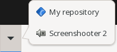
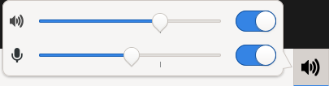

Applets
=======

-----
Clock
-----

.. image:: ../images/applets/clock.webp
    :alt: Clock

.. code-block:: toml

    [[panel.applet]]
        name = "clock"
        format = "%X"
        [panel.applet.font]
            family = ""
            style = "normal"
            weight = "bold"
            size = -1
            strikethrough = false
            underline = "none"
            letter_spacing = -1

-1 or "" means the default setting. Basically all of this is setted to default and applet will be alive without this config.

=================== =============================================================================== ======================================
**Parameter**       **Description**																    **Content**
------------------- ------------------------------------------------------------------------------- --------------------------------------
format              `strftime <https://www.cplusplus.com/reference/ctime/strftime/>`_ format string Any strftime-compliant string
font.family         A font familiy                                                                  Any font in your pc e.g. 'Comic Sans'
font.style			Style of the font                                                               normal, oblique or italic
font.weight			Weight of the font																thin, ultrathin, semilight, book, normal, medium, semibold, bold, ultrabold, heavy, ultraheavy
font.size			Size of the font																Any positive integer or -1 for default value
font.strikethrough	You know what that means.														true or false
font.underline		Underline.																		none, single, double, low, error
font.letter_spacing	Spacing between letters															Any positive integer or -1 for default value
=================== =============================================================================== ======================================

GTK and CSS structure:

.. code-block:: none

    GtkButton[(.|#)clock(-id)]
    | - GtkLabel

.. code-block:: none

    GtkPopover[(.|#)clock-popover(-id)]
    | - GtkCalendar

---------
Separator
---------

.. code-block:: toml

    [[panel.applet]]
    name = "separator"
    stretch = true
    margin_start = 0
    margin_end = 0

This is the default config of **separator** applet.
All you need to know is, `stretch` extends applet to fill all of the panel,
`margin_start` and `margin_end` changes margins of applet.

-------------
Task switcher
-------------

.. image:: ../images/applets/task-switcher.webp
    :alt: Task switcher

.. code-block:: toml

    [[panel.applet]]
    name = "task-switcher"
        [panel.applet.mode.scroll]
        fallback_icon = "application-x-executable"
        expand = true
        minimum_windows_per_row = 6
        maximum_windows_per_row = 12
            [panel.applet.mode.scroll.button]
            icon_only = false
            gap = 8
            flat = false
            icon_height = -1

This text above is default settings. You can ommit all of this but `name` must be present.
-1 means automatic option.

=================================== ========================================================== ===========
**Parameter**                       **Description**											   **Content**
----------------------------------- ---------------------------------------------------------- -----------
mode.scroll.fallback_icon           Fallback icon if applet can't find any.					   Text
mode.scroll.expand                  If applet should expand to fill as much space as possible. true/false
mode.scroll.minimum_windows_per_row Minimum window buttons per task bar row.                   Integer
mode.scroll.maximum_windows_per_row Maximum window buttons per task bar row.                   Integer
mode.scroll.button.icon_only        If only icon should be presented on button.                true/false
mode.scroll.button.gap				Gap between icon and window title.                         Integer
mode.scroll.button.flat             If button should be without shadows.                       true/false
mode.scroll.button.icon_height      Height of icon.                                            Integer
=================================== ========================================================== ===========

GTK and CSS structure:

.. code-block:: none

    GtkScrolledWindow[(.|#)task-switcher(-id)] // Window list
    | - GtkFlowBox
    | | - GtkFlowBoxChild

.. code-block:: none

    GtkFlowBoxChild  // Single window button
    | - GtkToggleButton
    | | - GtkBox
    | | | - GtkImage
    | | | - GtkLabel

.. code-block:: none

   GtkMenu[(.|#)task-switcher-context-menu(-id)]
   | ...

---------
Activator
---------

.. code-block:: toml

    [[panel.applet]]
        name = "activator"
        flat = false
        icon_height = -1

        [[panel.applet.activator]]
            type = "application"

            name = "Screenshooter"
            description = "You know what this means"
            icon = "application-x-executable"

            command = "<SOME SCREENSHOOTER APP>"
            working_directory = ""

        [[panel.applet.activator]]
            type = "hypertext"

            name = "Wapanel repository"
            description = "Shortcut to wapanel's repository"
            icon = "application-x-executable"

            url = "https://github.com/firstbober/wapanel"

This text above is default settings. You can ommit all of this but root `name` must be present.
-1 means automatic option.

=========================== ====================================== ===========================
**Parameter**               **Description**				           **Content**
--------------------------- -------------------------------------- ---------------------------
flat                        Should activator buttons be flat.      true/false
icon_height                 Height of the icon in activator.       Integer
activator.type              Type of activator.                     Text(application/hypertext)
activator.name              Name of activator.                     Text
activator.description       Description of activator.              Text
activator.icon              Icon of activator.                     Text
activator.command           Command that activator should execute. Text
activator.working_directory Working directory of executed command. Text
activator.url               URL of website.                        Text
=========================== ====================================== ===========================

GTK and CSS structure:

.. code-block:: none

    GtkBox[(.|#)activator(-id)]
    | - GtkButton
    | | ...
    | - GtkMenuButton
    | | - GtkPopover[(.|#)activator-popover(-id)]
    | | | - GtkButton
    | | | | ...
    | | | ...

.. code-block:: none

    GtkButton
    | - GtkImage
    | - GtkLabel

--------------
Volume control
--------------

.. code-block:: toml

    [[panel.applet]]
        name = "volume-control"
        flat = false
        icon_height = -1
        sound_mixer = ""

This text above is default settings. You can ommit all of this but root `name` must be present.
-1 means automatic option.

=========================== ====================================== ===========================
**Parameter**               **Description**				           **Content**
--------------------------- -------------------------------------- ---------------------------
flat                        Should activator buttons be flat.      true/false
icon_height                 Height of icon on panel.               Integer
sound_mixer                 Command to execute using Sound Mixer.  Text
=========================== ====================================== ===========================

GTK and CSS structure:

.. code-block:: none

    GtkMenuButton[(.|#)volume-control(-id)]
    | - GtkImage

.. code-block:: none

    GtkPopover[(.|#)volume-control-popover(-id)]
    | - GtkBox
    | | - GtkBox // Volume control
    | | - GtkBox // Volume control

.. code-block:: none

    GtkBox // Volume control
    | - GtkImage
    | - GtkScale
    | - GtkSwitch

--------------
App finder
--------------

.. image:: ../images/applets/app-finder.webp
    :alt: App finder

.. code-block:: toml

    [[panel.applet]]
        name = "app-finder"

        icon = ""
        icon_height = -1
        flat = false

        popover_width = -1
        popover_height = -1

        user_manager = ""
        settings = ""
        file_manager = ""

        [panel.applet.logout]
            shutdown = ""
            restart = ""
            logout = ""
            suspend = ""
            hibernate = ""
            lock = ""

This text above is default settings. You can ommit all of this but root `name` must be present.
-1 means automatic option.

=========================== ====================================== ===========================
**Parameter**               **Description**				           **Content**
--------------------------- -------------------------------------- ---------------------------
flat                        Should activator buttons be flat.      true/false
icon_height                 Height of icon on panel.               Integer
icon                        Icon of button.                        Text
popover_width               Width of app finder popover.           Integer
popover_height              Height of app finder popover.          Integer
user_manager                Executable name of account settings.   Text
settings                    Executable name of system settings.    Text
file_manager                Executable name of file manager.       Text
=========================== ====================================== ===========================

Logout popover:

=========================== ================== ===========
**Parameter**               **Description**    **Content**
--------------------------- ------------------ -----------
shutdown                    Shutdown command.  Text
restart                     Restart command.   Text
logout                      Logout command.    Text
suspend                     Suspend command.   Text
hibernate                   Hibernate command. Text
lock                        Lock command.      Text
=========================== ================== ===========

GTK and CSS structure:

.. code-block:: none

    GtkMenuButton[(.|#)app-finder(-id)] // Button on panel
    | - GtkImage

.. code-block:: none

    GtkPopover[(.|#)app-finder-popover(-id)] // Popover after click
    | - GtkBox
    | |
    | | - GtkBox // Sidebar with file manager etc.
    | | |
    | | | - GtkButton // User settings button
    | | | | - GtkImage
    | | | |
    | | | - GtkBox // Container with action buttons
    | | | |
    | | | | - GtkButton // Settings button
    | | | | | - GtkImage
    | | | |
    | | | | - GtkButton // File manager button
    | | | | | - GtkImage
    | | | |
    | | | | - GtkButton // Logout button
    | | | | | - GtkImage
    | | | |
    | | |
    | |
    | | - GtkBox // App list and categories

.. code-block:: none

    GtkBox // App list and categories
    | - GtkStack
    | |
    | | - GtkNotebook[(.|#)app-finder-category-notebook(-id)]
    | | |
    | | | - GtkScrolledWindow[(.|#)app-finder-category-app-list(-id)]
    | | | | - GtkViewport
    | | | | - GtkListBox

.. code-block:: none

    GtkPopover[(.|#)app-finder-popover(-id)] // Popover popped after logout button
    | - GtkButton // Some action eg. logout
    | |
    | | - GtkBox
    | | | - GtkImage
    | | | - GtkLabel
    | | |
    | |
    | ... // More buttons